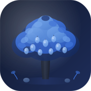

<div align="center">



# Canopy

### Grow your impact. Shrink your footprint.

**A full-stack carbon footprint awareness platform where your sustainable actions grow a living ecosystem.**

[](https://nextjs.org)
[](https://typescriptlang.org)
[](https://tailwindcss.com)
[](https://aistudio.google.com)
[](https://firebase.google.com)
[](https://cloud.google.com/run)
[](LICENSE)

[🌐 Live Demo](https://canopy-738945954126.asia-south1.run.app) · [Blog](https://canopy-738945954126.asia-south1.run.app/blog) · [Google Solution Challenge](https://developers.google.com/community/gdsc-solution-challenge)

</div>

---

## What is Canopy?

Canopy is a **sustainability companion** — not just a carbon calculator. Every real-world action you take directly transforms a living digital ecosystem. Log a metro ride, eat a vegetarian meal, skip an online order — and watch your tree grow leaves, flowers bloom, birds arrive, and butterflies appear.

Built for the **Google Solution Challenge**, Canopy targets **UN SDG 13: Climate Action** by making carbon awareness personal, visual, and emotionally engaging — specifically calibrated for Indian users.

> *"Every choice is a seed."*

---

## 🌐 Live Deployment

**Production URL:** https://canopy-738945954126.asia-south1.run.app

Deployed on **Google Cloud Run** (`asia-south1` — Mumbai region) via Cloud Build. No Docker required locally — the entire build pipeline runs on GCP.

| Page | URL |
|---|---|
| Landing | https://canopy-738945954126.asia-south1.run.app |
| Sign Up | https://canopy-738945954126.asia-south1.run.app/signup |
| Login | https://canopy-738945954126.asia-south1.run.app/login |
| Dashboard | https://canopy-738945954126.asia-south1.run.app/dashboard |
| Blog | https://canopy-738945954126.asia-south1.run.app/blog |

---


### 🔐 Firebase Authentication
- Email/Password sign-up and login
- Google OAuth one-tap sign-in
- Protected routes — dashboard requires authentication
- Persistent sessions via Firebase Auth state listener
- Firestore for cross-device data sync

### 🌳 Living Ecosystem (7 Growth Stages)
The entire dashboard centers on an organic SVG ecosystem that evolves based on your real behavior — not a chart, not a widget. A living, breathing world that reflects your climate impact.

| Score | Stage |
|---|---|
| 0–10 | Bare Soil — a tiny sprout just taking root |
| 10–25 | Small Sapling — first leaves appear |
| 25–40 | Young Tree — branches forming |
| 40–55 | Healthy Tree — full canopy |
| 55–72 | Large Tree — flowers bloom |
| 72–88 | Forest Tree — birds nest |
| 88–100 | Flourishing Ecosystem — butterflies, particles, full scene |

### 📊 Carbon Engine
Real emission factors calibrated for India (IPCC AR6, MoEFCC, CEEW):

| Category | Modes Tracked |
|---|---|
| Travel | Petrol/Diesel/Electric Car, Bus, Auto Rickshaw, Metro, Domestic/International Flight |
| Food | Beef, Lamb, Chicken, Fish, Vegetarian, Vegan |
| Energy | Electricity (0.82 kg CO₂/kWh) |
| Shopping | Clothing, Online Orders, Smartphone |

### 🤖 AI Coach (Powered by Gemini)
Personalized sustainability coaching using your actual activity data — not generic tips. Quantified CO₂ savings, Indian context, smart offline fallback.

### 🏆 Challenges & Achievements
5 auto-tracked challenges, 10 achievement badges (4 rarity tiers), streak system with milestone unlocks.

### 📝 Blog
Original long-form content on climate science, sustainability tips, product transparency, and India-specific climate action. 6 articles at launch, statically pre-rendered.

### 🎉 Celebration System
Canvas particle animations on every meaningful milestone — challenge completions, streak milestones, ecosystem upgrades.

### 📈 Insights & Analytics
Weekly trends, category breakdowns, vs Indian average comparison, monthly bar charts — all in pure SVG.

---

## 🛠️ Tech Stack

| Layer | Technology |
|---|---|
| Framework | Next.js 16.2 (App Router, Turbopack) |
| Language | TypeScript 5.7 |
| Styling | Tailwind CSS v4 |
| State | Zustand 5 with localStorage persistence |
| AI | Google Gemini 2.0 Flash via `@google/generative-ai` |
| Auth | Firebase Authentication (Email/Password + Google OAuth) |
| Database | Firebase Firestore (offline IndexedDB persistence) |
| Deployment | GCP Cloud Run via Docker |
| Icons | Lucide React |
| Fonts | DM Sans + Geist Mono |

---

## 🚀 Getting Started

### Prerequisites
- Node.js 18+
- npm or pnpm
- A Firebase project (free Spark plan is enough)
- A Gemini API key (free at [aistudio.google.com](https://aistudio.google.com/app/apikey))

### 1. Clone

```bash
git clone https://github.com/your-username/canopy.git
cd canopy
```

### 2. Install dependencies

```bash
npm install
```

### 3. Configure environment variables

```bash
cp .env.local.example .env.local
```

Edit `.env.local` with your values:

```env
# Gemini AI Coach
GEMINI_API_KEY=your_gemini_api_key

# Firebase (required for auth and data sync)
NEXT_PUBLIC_FIREBASE_API_KEY=your_api_key
NEXT_PUBLIC_FIREBASE_AUTH_DOMAIN=your_project.firebaseapp.com
NEXT_PUBLIC_FIREBASE_PROJECT_ID=your_project_id
NEXT_PUBLIC_FIREBASE_STORAGE_BUCKET=your_project.firebasestorage.app
NEXT_PUBLIC_FIREBASE_MESSAGING_SENDER_ID=your_sender_id
NEXT_PUBLIC_FIREBASE_APP_ID=your_app_id
```

### 4. Firebase setup

1. Create a project at [console.firebase.google.com](https://console.firebase.google.com)
2. Enable **Authentication** → Sign-in method → **Email/Password** + **Google**
3. Enable **Firestore Database** → Start in test mode

### 5. Run locally

```bash
npm run dev
```

Open [http://localhost:3000](http://localhost:3000)

---

## 📁 Project Structure

```
canopy/
├── app/
│   ├── api/coach/route.ts          # Gemini AI proxy
│   ├── blog/                       # Blog listing + [slug] article pages
│   ├── dashboard/page.tsx          # Protected dashboard (5-panel SPA)
│   ├── login/page.tsx              # Firebase login page
│   ├── signup/page.tsx             # Firebase signup page
│   ├── onboarding/page.tsx         # New user onboarding
│   └── page.tsx                    # Public landing page
│
├── components/canopy/
│   ├── auth-guard.tsx              # Route protection wrapper
│   ├── auth-form.tsx               # Login/signup form with Firebase
│   ├── auth-layout.tsx             # Split-panel auth layout
│   ├── blog-newsletter.tsx         # Newsletter signup (client component)
│   ├── app-provider.tsx            # Firebase auth state + achievement sync
│   ├── ecosystem/                  # 8-layer animated SVG ecosystem
│   └── dashboard/                  # Dashboard panel components
│
└── lib/
    ├── blog-data.ts                # Static blog post content + metadata
    ├── firebase-config.ts          # Firebase singleton initializer
    ├── firebase-service.ts         # Auth + Firestore CRUD
    ├── carbon-engine.ts            # Emission calculations
    ├── ecosystem-engine.ts         # Visual state computation
    ├── challenge-engine.ts         # Auto-progress tracking
    ├── achievement-engine.ts       # Badge unlock logic
    ├── analytics-engine.ts         # Weekly/monthly summaries
    ├── streak-engine.ts            # Consecutive day tracking
    ├── gemini-context-builder.ts   # Structured AI prompts
    └── store.ts                    # Zustand global state
```

---

## ☁️ Deploying to GCP Cloud Run

Canopy ships with a ready-to-use `deploy.ps1` script (Windows/PowerShell) that handles the full deployment pipeline.

### Prerequisites
- [Google Cloud SDK](https://cloud.google.com/sdk/docs/install) installed and authenticated
- [Docker Desktop](https://www.docker.com/products/docker-desktop/) running
- GCP project with billing enabled

### One-command deploy

```powershell
# From the project root
.\deploy.ps1
```

This script automatically:
1. Sets your GCP project
2. Enables Cloud Run + Artifact Registry APIs
3. Builds the Docker image with all env vars as build args
4. Pushes to Artifact Registry (`asia-south1`)
5. Deploys to Cloud Run with public HTTPS URL

### Manual deploy (bash / Cloud Shell)

```bash
export PROJECT_ID=your-gcp-project-id
export REGION=asia-south1

# Enable APIs
gcloud services enable run.googleapis.com artifactregistry.googleapis.com

# Create registry
gcloud artifacts repositories create canopy \
  --repository-format=docker --location=$REGION

# Auth docker
gcloud auth configure-docker $REGION-docker.pkg.dev

# Build & push
docker build \
  --build-arg NEXT_PUBLIC_FIREBASE_API_KEY=your_key \
  --build-arg NEXT_PUBLIC_FIREBASE_AUTH_DOMAIN=your_domain \
  --build-arg NEXT_PUBLIC_FIREBASE_PROJECT_ID=your_project_id \
  --build-arg NEXT_PUBLIC_FIREBASE_STORAGE_BUCKET=your_bucket \
  --build-arg NEXT_PUBLIC_FIREBASE_MESSAGING_SENDER_ID=your_sender \
  --build-arg NEXT_PUBLIC_FIREBASE_APP_ID=your_app_id \
  --build-arg GEMINI_API_KEY=your_gemini_key \
  -t $REGION-docker.pkg.dev/$PROJECT_ID/canopy/canopy:latest .

docker push $REGION-docker.pkg.dev/$PROJECT_ID/canopy/canopy:latest

# Deploy
gcloud run deploy canopy \
  --image $REGION-docker.pkg.dev/$PROJECT_ID/canopy/canopy:latest \
  --region $REGION \
  --platform managed \
  --allow-unauthenticated \
  --port 8080 \
  --memory 1Gi
```

### After deploy

Add your Cloud Run URL to **Firebase Console → Authentication → Settings → Authorized domains**.

---

## 🌐 Pages & Routes

| Route | Description | Auth Required |
|---|---|---|
| `/` | Landing page | No |
| `/login` | Firebase login | No |
| `/signup` | Firebase signup | No |
| `/onboarding` | New user setup | No |
| `/dashboard` | Main app (ecosystem, logging, AI coach) | ✅ Yes |
| `/blog` | Blog listing — 6 articles | No |
| `/blog/[slug]` | Full article pages (statically generated) | No |

---

## 📊 Emission Factors Reference

All values in kg CO₂e per unit. Sources: IPCC AR6, MoEFCC India, CEEW.

### Travel (per km)
| Mode | kg CO₂/km |
|---|---|
| Petrol Car | 0.21 |
| Diesel Car | 0.17 |
| Electric Car | 0.12 |
| Auto Rickshaw | 0.13 |
| Bus | 0.089 |
| Metro | 0.041 |
| Domestic Flight | 0.255 |
| International Flight | 0.195 |

### Food (per meal)
| Type | kg CO₂/meal |
|---|---|
| Beef | 3.0 |
| Chicken | 0.7 |
| Vegetarian | 0.3 |
| Vegan | 0.2 |

---

## 🤝 Contributing

1. Fork the repo
2. Create a branch: `git checkout -b feature/your-feature`
3. Commit: `git commit -m 'Add your feature'`
4. Push: `git push origin feature/your-feature`
5. Open a Pull Request

---

## 📄 License

MIT License — see [LICENSE](LICENSE) for details.

---

## 🙏 Acknowledgements

- [Google AI Studio](https://aistudio.google.com) — Gemini API
- [Firebase](https://firebase.google.com) — Auth and Firestore  
- [Google Cloud Run](https://cloud.google.com/run) — Deployment
- [Lucide React](https://lucide.dev) — Icons
- Emission data: IPCC AR6, MoEFCC India, CEEW

---

<div align="center">

Built with 🌱 for the **Google Solution Challenge**

**Canopy — Grow your impact. Shrink your footprint.**

[](https://canopy-738945954126.asia-south1.run.app)

</div>
